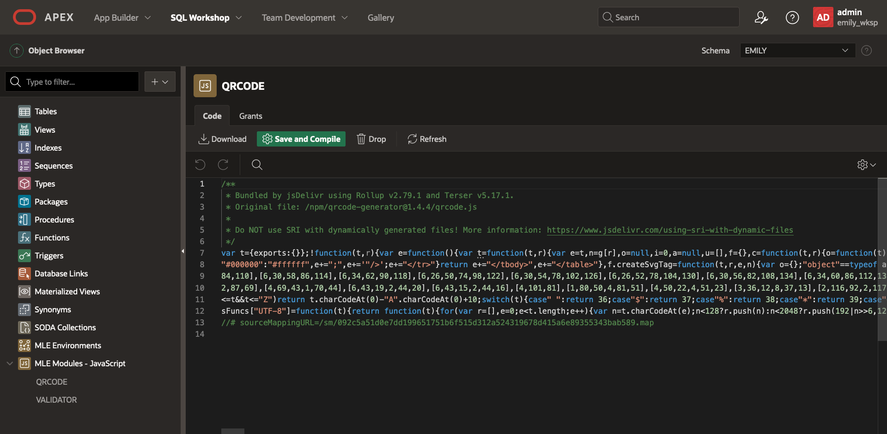

# Form Validation, Markdown Rendering and CR Code creation in APEX with JavaScript Modules

## Introduction

In this lab you will use APEX to install a few community JavaScript modules and use them in an existing application.

Estimated Time: 15 minutes.

### Objectives
Learn how to:
- Create MLE modules and environments with APEX.
- Use MLE modules in server-side code in APEX.

### Prerequisites
This lab assumes:
- Lab 1 has been completed, i.e. user EMILY and module VALIDATOR exist.
- You have ORDS running so you can open APEX 23.1.

## Task 1: Login and create APEX workspace

1. Open Activities -> Google Chrome -> New Window

    


2. Go to this URL and wait for the screen to load.
    ```
    <copy>
    http://localhost:8080/ords/apex_admin
    </copy>
    ```

    

3. Login as ADMIN with the password Welcome123# and reset it to as you please.

    

4. You can see the welcome screen for APEX now. 

    

5. Click create workspace

    

6. Name the workspace 'EMILY_WKSP' and click Next

    

7. Set reuse existing schema to Yes. Click the menu icon next to schema name and select EMILY. Leave the default for space quota and password. Click next.

    

8. Admin username: admin, password: Welcome123#, email: your email.

    

9. Review the output then click Create workspace.

    

10. Success! Now click done.

    

## Task 2: Import MLE modules and env from open-source JavaScript code

The APEX application that we will build will make use of the open-source JavaScript modules `validator`, `qrcode` and `marked` which we have to import into the database before using.
If you completed Lab 1 successfully, `VALIDATOR` should already exist.

In order to install the QRCODE module into Oracle as MLE module, fist go to the object browser:


Then, click on the "+" button in the left pane and select "MLE Module - JavaScript" or simply select this option from the middle pane:


This opens a dialog in which you provide the name of your module, `QRCODE`, as well as the version, `1.4.4` (not stricly required, but good practise).
You select `URL` as source type and enter `https://cdn.jsdelivr.net/npm/qrcode-generator@1.4.4/+esm`.
Note that you can get open-source JavaScript modules like this one from the CDN of your choice as long as they are provided in terms of an EcmaScript module (ESM).


What is left to do is to hit the "Create MLE Module" button and wait a few seconds to get the confirmation that the module was successfully created.



Now, repeat the same step to import the `marked` module and - if not done yet as part of Lab 1 - the `validator` module:
- marked:
    - name: MARKED
    - version: 5.0.2
    - URL: https://cdn.jsdelivr.net/npm/marked@5.0.2/+esm
- validator:
    - name: https://cdn.jsdelivr.net/npm/validator@13.9.0/+esm
    - version: 13.9.0
    - URL: https://cdn.jsdelivr.net/npm/qrcode-generator@1.4.4/+esm

### Task 3: Import App and make it run with JavaScript

## Learn More

- SQL Language Reference [CREATE MLE MODULE](https://docs.oracle.com/en/database/oracle/oracle-database/23/sqlrf/create-mle-module.html#GUID-EF8D8EBC-2313-4C6C-A76E-1A739C304DCC)
- SQL Language Reference [CREATE MLE ENV](https://docs.oracle.com/en/database/oracle/oracle-database/23/sqlrf/create-mle-env.html#GUID-419C81FD-338D-495F-85CD-135D4D316718)
- Chapter 2 in [JavaScript Developer's Guide](https://docs.oracle.com/en/database/oracle/oracle-database/23/mlejs/mle-js-modules-and-environments.html#GUID-32E2D1BB-37A0-4BA8-AD29-C967A8CA0CE1) describes modules and environments in detail
- [Database Reference](https://docs.oracle.com/en/database/oracle/oracle-database/23/refrn/index.html) contains the definition of all dictionary views
- [Mozilla Developer Network](https://developer.mozilla.org/en-US/docs/Web/JavaScript/Guide/Modules) section covering ECMAScript modules

## Acknowledgements

- **Author** - Martin Bach, Principal Program Manager, Oracle Labs
- **Contributors** -  Martin Bach, Sarah Hirschfeld
- **Last Updated By/Date** - Lucas Braun 01-JUN-2023
