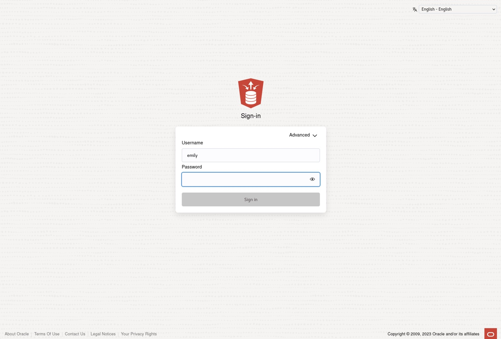
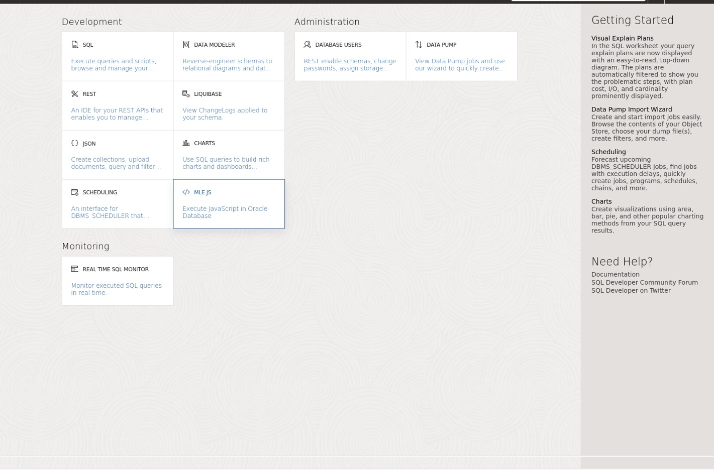
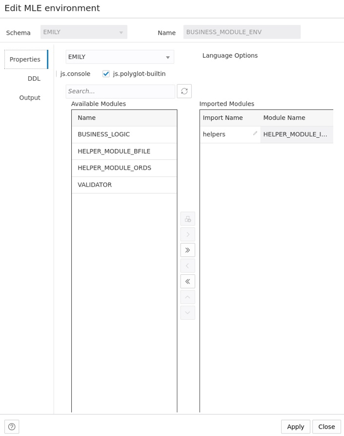
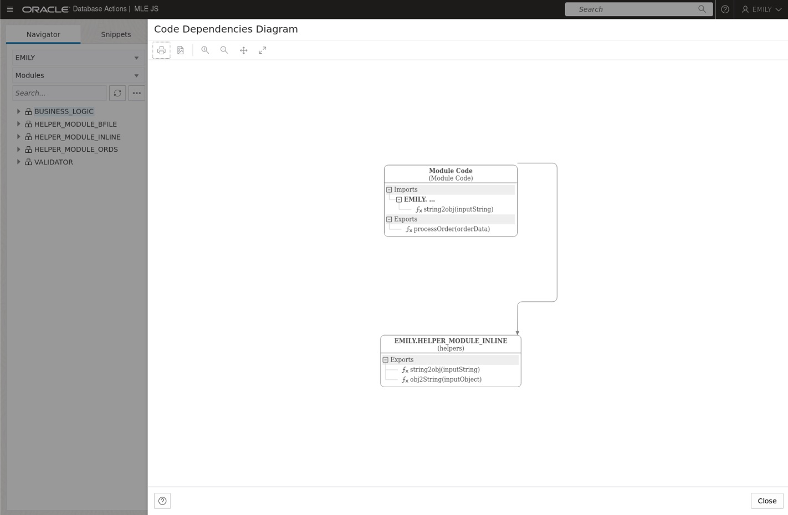

# Create JavaScript Modules and Environments

## Introduction

After the previous lab introduced JavaScript in Oracle Database 23c Free - Developer Release you will now learn more about Multilingual Engine (MLE) modules and environments. Modules are similar in concept to PL/SQL packages as they allow you to logically group code in a single namespace. Just as with PL/SQL you can create public and private functions. MLE modules contain JavaScript code expressed in terms of ECMAScript modules.

Estimated Lab Time: 10 minutes

### Objectives

In this lab, you will:

- Create a database session
- Create JavaScript modules
- Perform naming resolution using MLE environments
- View dictionary information about modules and environments

### Prerequisites

This lab assumes you have:

- An Oracle Database 23c Free - Developer Release environment available to use
- Created the `emily` account as per Lab 1

## Task 1: Create a database session

Connect to the pre-created Pluggable Database (PDB) `freepdb1` using the same credentials you supplied in Lab 1.

```bash
<copy>sqlplus emily/yourNewPasswordGoesHere@localhost/freepdb1</copy>
```

## Task 2: Create JavaScript modules

A JavaScript module is a unit of MLE's language code stored in the database as a schema object. Storing code within the database is one of the main benefits of using JavaScript in Oracle Database 23c Free-Developer Release: rather than having to manage a fleet of application servers each with their own copy of the application, the database takes care of this for you.

In addition, Data Guard replication ensures that the exact same code is present in both production and all physical standby databases. This way configuration drift, a common problem bound to occur when invoking the disaster recovery location, can be mitigated.

> **Note**: A JavaScript module in MLE is equivalent to an ECMAScript 6 module. The terms MLE module and JavaScript module are used interchangeably in this lab.

1. Create a JavaScript module inline

    The easiest way to create a JavaScript module is to provide the JavaScript code inline with the `create mle module` statement.

    ```sql
    <copy>create mle module helper_module_inline
    language javascript as 

    /**
     * convert a delimited string into key-value pairs and return JSON
     * @param {string} inputString - the input string to be converted
     * @returns {JSON}
     */
    function string2obj(inputString) {
        if ( inputString === undefined ) {
            throw `must provide a string in the form of key1=value1;...;keyN=valueN`;
        }
        let myObject = {};
        if ( inputString.length === 0 ) {
            return myObject;
        }
        const kvPairs = inputString.split(";");
        kvPairs.forEach( pair => {
            const tuple = pair.split("=");
            if ( tuple.length === 1 ) {
                tuple[1] = false;
            } else if ( tuple.length != 2 ) {
                throw "parse error: you need to use exactly one '=' between " + 
                        "key and value and not use '=' in either key or value";
            }
            myObject[tuple[0]] = tuple[1];
        });
        return myObject;
    }

    /**
     * convert a JavaScript object to a string
     * @param {object} inputObject - the object to transform to a string
     * @returns {string}
     */
    function obj2String(inputObject) {
        if ( typeof inputObject != 'object' ) {
            throw "inputObject isn't an object";
        }
        return JSON.stringify(inputObject);
    }

    export { string2obj, obj2String }
    /</copy>
    ```

2. Create a JavaScript module from a file in the file system

    Another popular way of creating a JavaScript module is by loading it from the file system. The `BFILE` clause in the `create mle module` statement can be used to this effect. You created a directory object named `javascript_src_dir` in the previous lab, it will be used again in this lab. Exit `sqlplus` first, then copy the JavaScript code into a file.

    ```bash
    $ <copy>cat <<'EOF' > /home/oracle/hol23c/helper_module_bfile.js
    /**
     * convert a delimited string into key-value pairs and return JSON
     * @param {string} inputString - the input string to be converted
     * @returns {JSON}
     */
    function string2obj(inputString) {
        if ( inputString === undefined ) {
            throw `must provide a string in the form of key1=value1;...;keyN=valueN`;
        }
        let myObject = {};
        if ( inputString.length === 0 ) {
            return myObject;
        }
        const kvPairs = inputString.split(";");
        kvPairs.forEach( pair => {
            const tuple = pair.split("=");
            if ( tuple.length === 1 ) {
                tuple[1] = false;
            } else if ( tuple.length != 2 ) {
                throw "parse error: you need to use exactly one '=' " + 
                    " between key and value and not use '=' in either key or value";
            }
            myObject[tuple[0]] = tuple[1];
        });
        return myObject;
    }

    /**
     * convert a JavaScript object to a string
     * @param {object} inputObject - the object to transform to a string
     * @returns {string}
     */
    function obj2String(inputObject) {
        if ( typeof inputObject != 'object' ) {
            throw "inputObject isn't an object";
        }
        return JSON.stringify(inputObject);
    }

    export { string2obj, obj2String }
    EOF</copy>
    ```

    With the file in place you can create the module in the next step. Create a database session first ...

    ```bash
    <copy>sqlplus emily/yourNewPasswordGoesHere@localhost/freepdb1</copy>
    ```

    ... before you create the module

    ```sql
    <copy>
    create mle module helper_module_bfile
    language javascript
    using bfile (javascript_src_dir, 'helper_module_bfile.js');
    /
    </copy>
    ```

3. Create a JavaScript module with Database Actions

    Database Actions is a web-based interface that uses Oracle REST Data Services (ORDS) to provide development, data studio, administration and monitoring features for Oracle Database. You REST-enabled your schema in the first lab by calling `ords.enable_schema`. With Database Actions you can create JavaScript modules using a browser interface.

    Start by pointing your browser to TODO and log in to database actions using the password you assigned to the `emily` user.

    

    Once connected, navigate to the MLE JS tile

    

    Once you opened the editor, paste the JavaScript portion of the code you used for `helper_module_inline` into the editor pane, assign a name to the module (`HELPER_MODULE_ORDS`) and use the disk icon to persist the module in the database.

    

## Task 3: Perform name resolution using MLE environments

1. Reference existing modules

    The more modular your code, the more reusable it is. JavaScript modules in Oracle Database 23c Free-Developer Release can reference other modules easily, allowing developers to follow a divide and conquer approach designing applications. The code shown in the following snippet makes use of the module `helper_module_inline` created earlier to convert a string representing an order before inserting it into a table.

    > **Note**: Lab 4 will explain the use of the JavaScript SQL Driver in more detail.

    The following example makes use of the `SH` sample schema. If you don't have the sample schemas installed in your PDB you can create a simplified version of the `ORDERS` table as follows:

    ```sql
    <copy>
    create table orders (
        order_id     number(12) not null,
        order_date   date not null,
        order_mode   varchar2(8),
        customer_id  number(6) not null,
        order_status number(2),
        order_total  number(8,2),
        sales_rep_id number(6),
        promotion_id number(6),
        constraint pk_orders primary key(order_id)
    );
    </copy>
    ```

    The `business_logic` module will insert an order into that table after converting a comma-separated string to a JSON document which is eventually parsed by `json_table()`.

    ```sql
    <copy>
    create mle module business_logic language javascript as

    import { string2obj } from 'helpers';

    export function processOrder(orderData) {
        
        const orderDataJSON = string2obj(orderData);
        const result = session.execute(`
            insert into orders (
                order_id,
                order_date,
                order_mode, 
                customer_id, 
                order_status,
                order_total, 
                sales_rep_id, 
                promotion_id
            )
            select
                jt.*
            from 
                json_table(:orderDataJSON, '$' columns
                    order_id             path '$.order_id',
                    order_date timestamp path '$.order_date',
                    order_mode           path '$.order_mode',
                    customer_id          path '$.customer_id', 
                    order_status         path '$.order_status',
                    order_total          path '$.order_total', 
                    sales_rep_id         path '$.sales_rep_id',
                    promotion_id         path '$.promotion_id'
            ) jt`,
            {
                orderDataJSON: {
                    val: orderDataJSON,
                    type: oracledb.DB_TYPE_JSON
                }
            }
        );

        if ( result.rowsAffected === 1 ) {
            return true;
        } else {
            return false;
        }
    }
    /
    </copy>
    ```

2. Understand name resolution in JavaScript powered by Multilingual Engine (MLE)

    The `business_logic` module introduces a new concept: an (ECMAScript) `import` statement. `string2JSON()`, defined in the helpers module is imported into the module's namespace.

3. Create an environment

    The following snippet creates an environment mapping the import name `helpers` as seen in the `business_logic` module to `helper_module_inline`

    ```sql
    <copy>
    create mle env business_module_env
    imports (
        'helpers' module helper_module_inline
    );
    </copy>
    ```

    Database Actions supports working with environments as well. From the drop down on the left navigation pane select "Environments" to obtain a list of environments. You should see the `BUSINESS_MODULE_ENV` listed. Right-click the environment's name and choose `Edit` to review the environment definition.

    

    The environment will play a crucial role when exposing JavaScript code to SQL and PL/SQL, a topic that will be covered in the next lab (Lab 3). It also helps you understand dependencies. Database Actions allows you to view these. Right-click on the `BUSINES_LOGIC` module in the tree view on the left-hand side and select "Dependencies Diagram". The following diagram is shown, showing `BUSINESS_LOGIC`'s dependency on `HELPER_FUNCTIONS_INLINE`.

    

    In case you don't see the connection between `HELPER_MODULE_INLINE` and `BUSINESS_LOGIC` you need to associate `BUSINESS_LOGIC_ENV` with the module. To do so, close the Dependency Diagram and right-click on the `BUSINESS_LOGIC` module. Select `Edit` and associate the `BUSINESS_MODULE_ENV` environment with the module. Should the drop-down be empty click on the reload icon next to it and try again

    

## Task 4: View dictionary information about modules and environments

A number of dictionary views allow you to see which modules are present in your schema, which environments were created, and which import names have been mapped to modules. Existing views like `ALL_SOURCE` have been extended to show the module's source code.

1. View the source code of `helper_module_inline`

    ```sql
    <copy>
    col line for 9999
    col text for a90
    set lines 120 pages 100
    select 
        line, 
        text 
    from
        user_source 
    where 
        name = 'HELPER_MODULE_INLINE';</copy>
    ```

    You should see the following output:

    ```
    LINE TEXT
    ----- ------------------------------------------------------------------------------------
        1 function string2obj(inputString) {
        2     if ( inputString === undefined ) {
        3         throw `must provide a string in the form of key1=value1;...;keyN=valueN`;
        4     }
        5     let myObject = {};
        6     if ( inputString.length === 0 ) {
        7         return myObject;
        8     }
        9     const kvPairs = inputString.split(";");
        10     kvPairs.forEach( pair => {
        11         const tuple = pair.split("=");
        12         if ( tuple.length === 1 ) {
        13             tuple[1] = false;
        14         } else if ( tuple.length != 2 ) {
        15             throw "parse error: you need to use exactly one '=' between " +
        16                   "key and value and not use '=' in either key or value";
        17         }
        18         myObject[tuple[0]] = tuple[1];
        19     });
        20     return myObject;
        21 }
        22 /**
        23  * convert a JavaScript object to a string
        24  * @param {object} inputObject - the object to transform to a string
        25  * @returns {string}
        26  */
        27 function obj2String(inputObject) {
        28     if ( typeof inputObject != 'object' ) {
        29         throw "inputObject isn't an object";
        30     }
        31     return JSON.stringify(inputObject);
        32 }
        33 export { string2obj, obj2String }
    ```

2. View information about modules in your schema

    ```sql
    <copy>
    col module_name for a40
    col language_name for a20
    select
        module_name,
        language_name
    from
        user_mle_modules
    where
        language_name = 'JAVASCRIPT'
    order by
        module_name;
        </copy>
    ```

    You should see the following output:

    ```
    MODULE_NAME                              LANGUAGE_NAME
    ---------------------------------------- --------------------
    BUSINESS_LOGIC                           JAVASCRIPT
    HELPER_MODULE_BFILE                      JAVASCRIPT
    HELPER_MODULE_INLINE                     JAVASCRIPT
    VALIDATOR                                JAVASCRIPT
    ```

3. List all environments in your schema

    ```sql
    <copy>
    col env_name for a20
    select
        env_name
    from
        user_mle_envs
    order by
        env_name;
    </copy>
    ```

    You should see the following output:

    ```
    ENV_NAME
    --------------------
    BUSINESS_MODULE_ENV
    ```

4. List all environments together with their module to import name mappings

    ```sql
    <copy>
    col import_name for a30
    col module_name for a30
    select
        env_name,
        import_name,
        module_name
    from
        user_mle_env_imports
    order by
        env_name;
    </copy>
    ```

    You should see the following output:

    ```
    ENV_NAME             IMPORT_NAME                    MODULE_NAME
    -------------------- ------------------------------ ------------------------------
    BUSINESS_MODULE_ENV  helpers                        HELPER_MODULE_INLINE
    ```

## Learn More

- SQL Language Reference [CREATE MLE MODULE](https://docs.oracle.com/en/database/oracle/oracle-database/23/sqlrf/create-mle-module.html#GUID-EF8D8EBC-2313-4C6C-A76E-1A739C304DCC)
- SQL Language Reference [CREATE MLE ENV](https://docs.oracle.com/en/database/oracle/oracle-database/23/sqlrf/create-mle-env.html#GUID-419C81FD-338D-495F-85CD-135D4D316718)
- Chapter 2 in [JavaScript Developer's Guide](https://docs.oracle.com/en/database/oracle/oracle-database/23/mlejs/mle-js-modules-and-environments.html#GUID-32E2D1BB-37A0-4BA8-AD29-C967A8CA0CE1) describes modules and environments in detail
- [Database Reference](https://docs.oracle.com/en/database/oracle/oracle-database/23/refrn/index.html) contains the definition of all dictionary views
- [Mozilla Developer Network](https://developer.mozilla.org/en-US/docs/Web/JavaScript/Guide/Modules) section covering ECMAScript modules

## Acknowledgements

- **Author** - Martin Bach, Senior Principal Product Manager, ST & Database Development
- **Contributors** -  Lucas Braun, Sarah Hirschfeld
- **Last Updated By/Date** - Martin Bach 02-MAY-2023
